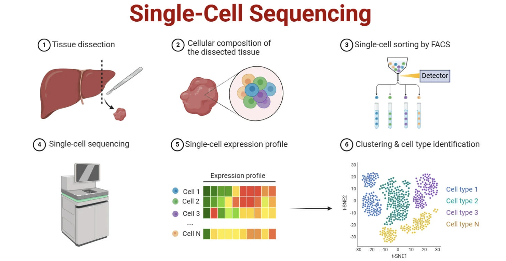

```{=html}
<script src="https://kit.fontawesome.com/ece750edd7.js" crossorigin="anonymous"></script>
```

High Throughput Sequencing (HTS) can be divided into two main branches: short read and long read sequencing. Each has different providers and specifications, which are described in the sections below.

## Short Reads

Short read sequencing, also known as second generation sequencing, involves breaking strands of DNA or RNA into smaller fragments, typically ranging from  50–300 bp, and sequencing these fragments. Short read sequencing generally provides highly accurate reads at a relatively low cost, making it a widely used approach across a broad range of applications. Though there are several different providers, short read sequencing can create two main types of reads: single end or paired end reads.

### Single end sequencing

As the name suggests, single end sequencing involves sequencing a DNA or RNA fragment from one end only. This is the simplest and most straightforward sequencing approach, but provides less information about the fragment compared with paired end sequencing. Single read sequencing is often adequate for applications such as gene expression analysis, where the primary goal is to quantify the abundance of transcripts, or for applications where the genomic context of the reads is not critical.

### Paired end reads

This involves sequencing the same fragment from both ends, generating two reads per fragment. These two fragments are refered to as forward (or R1) and reverse (or R2) reads. Depending on the size of the fragments, the forward and reverse read can overlap each other. Paired end sequencing is particularly useful for applications such as the detection of genomic rearrangements, repeats, gene fusions, novel transcripts, and other structural or transcriptomic features.

{width="500"}

Different platforms are available for short read sequencing, these platforms employing different approaches to create short reads. In most cases, sequencing is based on sequencing by synthesis, sequencing by ligation, or sequencing by binding. The most used platforms are discussed below.

-   [Illumina](https://www.illumina.com/): Currently the dominant provider in the short read sequencing market and has been established in the field for many years. As a result, a large proportion of publicly available short read sequencing data has been generated using Illumina platforms.
-   [Element Biosciences](https://www.elementbiosciences.com/): Relatively new to the sequencing market and has grown rapidly in recent years. Element's platforms offer highly accurate quality sequencing while aiming to provide a lower cost per read compared with established Illumina platforms.
-   [Ultima Genomics](https://www.ultimagenomics.com/): Another relatively new provider that is rapidly gaining momentum. Ultima focuses on highly scalable sequencing and aims to substantially reduce sequencing costs compared with traditional short read platforms.
-   [MGI](https://mgi-tech.eu/): A major sequencing provider with a particularly strong presence in Asia. Its platforms are also available in selected laboratories and sequencing facilities in Europe. It provides highly accurate short reads for a reduced cost compared to Illumina.

For a long time, Illumina dominated the short read sequencing field. Though the shift is slow, more and more labs are shifting to other platforms for short read sequencing needs.

::: {style="text-align: center;"}
<iframe width="560" height="315" src="https://www.youtube.com/embed/fCd6B5HRaZ8?si=fCW7-TZomZQrwgQU" title="YouTube video player" frameborder="0" allow="accelerometer; autoplay; clipboard-write; encrypted-media; gyroscope; picture-in-picture; web-share" referrerpolicy="strict-origin-when-cross-origin" allowfullscreen></iframe>
:::

## Long Reads

Long read sequencing, also known as third generation sequencing, focuses on generating longer reads than short read technologies. The two main platforms dominating the long read sequencing field are PacBio and Oxford Nanopore Technologies (ONT). Although both technologies are capable of generating reads that are considerably longer than those produced by short read platforms, they differ in their underlying approaches. Long read platforms generate single end reads.

### PacBio 
 
[PacBio](https://www.pacb.com/) focuses on generating highly accurate long reads, typically with read lengths around 10–25 kb. It combines long read sequencing with high accuracy by sequencing the same DNA molecule multiple times and generating a highly accurate consensus sequence. In addition to determining the DNA sequence, PacBio sequencing can provide information about the kinetics of nucleotide incorporation, which can be used to identify DNA modifications such as methylation without requiring a separate methylation-specific sequencing assay.

::: {style="text-align: center;"}
<iframe width="560" height="315" src="https://www.youtube.com/embed/7yYPHatccgw?si=P5FwouYl3Zyx9dSy" title="YouTube video player" frameborder="0" allow="accelerometer; autoplay; clipboard-write; encrypted-media; gyroscope; picture-in-picture; web-share" referrerpolicy="strict-origin-when-cross-origin" allowfullscreen></iframe>
:::

### Oxford Nanopore

[Oxford Nanopore](https://nanoporetech.com/) has a strong emphasis on ultra-long reads and real-time sequencing. ONT can generate extremely long reads, with reads extending to megabase-scale lengths and, under specialised conditions, exceeding several megabases. The ability to generate ultra-long reads can be particularly valuable for resolving large structural variants, repetitive regions, complex genomic regions, and complete chromosome-scale assemblies. ONT sequencing can also detect DNA methylation and other base modifications directly from the sequencing signal. Another major advantage of ONT is its portability and flexibility. The company's smallest sequencer, the MinION, is approximately the size of a USB stick and can be connected directly to a computer.

::: {style="text-align: center;"}
<iframe width="560" height="315" src="https://www.youtube.com/embed/VxGliKyYuFQ?si=1AZqxS-I63KVEpkx" title="YouTube video player" frameborder="0" allow="accelerometer; autoplay; clipboard-write; encrypted-media; gyroscope; picture-in-picture; web-share" referrerpolicy="strict-origin-when-cross-origin" allowfullscreen></iframe>
:::

## Single cell sequencing

Single cell sequencing is a powerful technique that allows researchers to study individual cells, providing insights into cellular heterogeneity and enabling the identification of rare cell populations. Single cell sequencing can be performed using both short read and long read technologies, depending on the specific research goals and requirements. Single cell sequencing is not covered in this course.

{width="500" align="center"}

## Data files

Although sequencing technologies and output data can differ between providers, the file formats used to deliver sequencing data are largely standardised. The two main file formats encountered in sequencing workflows are [FASTQ](https://en.wikipedia.org/wiki/FASTQ_format) and [BAM](https://en.wikipedia.org/wiki/BAM_(file_format)). Both formats contain information about the sequenced DNA or RNA and the quality of the sequencing data. FASTQ files contain the sequence reads together with a quality score for each base, whereas BAM files can contain more information about each read. Both file types will be explored during the course.

### Sequencing quality

Sequencing quality refers to the accuracy and reliability of the base calls made during the sequencing process. Each base in a sequencing read is assigned a quality score that reflects the confidence in the accuracy of that base call. Quality scores are affected by various factors, including the signal intensity, base-calling algorithms, and the overall performance of the sequencing platform.

Sequencing quality is commonly represented using [Phred](https://en.wikipedia.org/wiki/Phred_quality_score) quality scores. A Phred score provides an estimate of the probability that a base has been incorrectly identified, with higher scores indicating greater confidence in the base call. The Phred score (Q) is calculated using the formula below, where P is the probability of an incorrect base call.:

$$
\text{Phred score (Q)} = -10 \times \log_{10}(P)
$$

A Phred score of 20 (Q20) corresponds to a 1% chance of an incorrect base call, while a Phred score of 30 (Q30) corresponds to a 0.1% chance of an incorrect base call. As a general rule, Q20 or higher is considered acceptable to good quality, while Q30 or higher is often used as a benchmark for high-quality sequencing data. However, what constitutes an acceptable quality score ultimately depends on the sequencing platform, application, and downstream analysis.