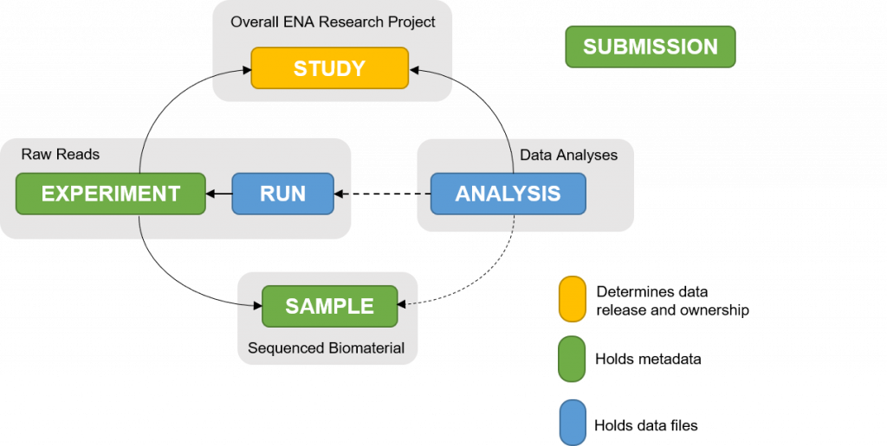

```{=html}
<script src="https://kit.fontawesome.com/ece750edd7.js" crossorigin="anonymous"></script>
```

Millions of sequencing datasets are now publicly available online thanks to the efforts of various research institutions and funding bodies. These datasets can be used for a variety of purposes, including testing, writing applications, and performing comparative data analyses.

## Sequencing data repositories

When publishing scientific articles, it is required practice to make sequencing data available online. This is often achieved through public repositories, which allow researchers to share their data with the scientific community and adhere to [FAIR](https://www.go-fair.org/fair-principles/) data principles:

- **Findable**: Data should be easy to find for both humans and computers. This includes the use of metadata and unique identifiers.
- **Accessible**: Once the user finds the required data, they need to know how it can be accessed, possibly including authentication and authorisation.
- **Interoperable**: The data should be able to be integrated with other data and work with standard applications or workflows for analysis, storage, and processing.
- **Reusable**: The ultimate goal of FAIR is to optimise the reuse of data. To achieve this, metadata and data should be well-described so that they can be replicated or reused in different settings.

In this session, we will explore two of the most commonly used public repositories for sequencing data: The National Center for Biotechnology Information (NCBI) and the European Nucleotide Archive (ENA). We will discuss how to search for data, download it, and perform quality checks.

## NCBI 

The [NCBI](https://www.ncbi.nlm.nih.gov/) website is a comprehensive resource for biological information based in the United States. It provides a wide range of tools and databases, including those for sequence analysis, gene annotation, and functional genomics.

Sequencing data is split between two main repositories: Gene Expression Omnibus (GEO) and Sequence Read Archive (SRA). GEO contains data from functional genomics experiments, including metadata and experimental results, while SRA is explicitly for raw sequencing reads.

### GEO

[GEO](https://www.ncbi.nlm.nih.gov/geo/) (Gene Expression Omnibus) is a public repository for functional genomics data. It contains data from experiments such as gene expression profiling, RNA-seq, microarrays, epigenomics, and other high-throughput assays..

To search the GEO database, click "Search for Studies at GEO DataSets" from the home page or navigate to the [Geo DataSets](https://www.ncbi.nlm.nih.gov/gds/) page.

:::: challenge
<h2><i class="fas fa-pencil-alt"></i> Challenge 1:</h2>

Search for the famous cell line `HeLa`. How many results do you get? How many of these results were published in the last year? How many have a sample count between 100 and 200?

<details>

<summary>Solution</summary>

::: solution
<h2><i class="far fa-eye"></i> Solution:</h2>

To search, just type 'HeLa' in the search bar. Once the results are available, you can filter the results by publication date on the left hand side. There is also a filter for `Sample count`. If you do not see this option, click `Show additional filters`. Set the sample count to between 100 and 200. 

:::

</details>
::::

GEO has an advanced set of filters that allow you to search by specific metadata (organism, cell type etc.) and keywords. Often when looking for published data, the starting point will be a publication of interest rather than the GEO database. When data is published in a paper, the authors will often include a link to the GEO record. This is usually in the form of a unique **GEO accession** number, which can be used to find the data. 

:::: challenge
<h2><i class="fas fa-pencil-alt"></i> Challenge 2:</h2>

Open [https://pmc.ncbi.nlm.nih.gov/articles/PMC13391367/](https://pmc.ncbi.nlm.nih.gov/articles/PMC13391367/), a paper titled "Molecular basis of polyadenylated RNA fate determination in the nucleus". 

Take a look at the data availability section. Can you find this dataset in GEO?

<details>

<summary>Solution</summary>

::: solution
<h2><i class="far fa-eye"></i> Solution:</h2>

Generally towards the end of the paper there will be a section with `Data Availability`. Find the GEO accession code. Either click the link or copy the ID and search for it in GEO. 

:::

</details>
::::

The accession number will take you to a **GEO series** record with a summary of the experiment, the overall design and various links to associated samples and platforms. The GEO database is structured into three main levels:

- `Series`: A Series record represents a complete experiment, including the associated samples and platforms used. GEO series are assigned unique accession numbers beginning with "GSE" (e.g., GSE285333). 
- `Sample`: A Sample record describes an individual sample, including the conditions and material from which the data were generated (organism, tissue type, cell line, genotype, condition) and analysis methods used to process the data. GEO samples are assigned unique accession numbers beginning with "GSM" (e.g., GSM8700904).
- `Platform`: A Platform record describes the technology used to generate the data, such as a specific microarray or sequencing platform (e.g. Illumina NextSeq 2000). GEO platforms are assigned unique accession numbers beginning with "GPL" (e.g., GPL30173).

A series record in GEO provides a comprehensive overview of an experiment as well as all of the sample and platform records associated with the study. It should also contain a citation to any publications that have resulted from the study. At the bottom of the record you will find some files associated with the study. These files can be downloaded and contain data associated with the entire study (e.g. gene expression matrices for all samples).

A GEO series can also be part of a **super series**, which is a collection of related series that share a common theme or experimental design. This is common in large-scale studies that utilise multiple technologies e.g. RNA-seq and ChIP-seq.

Click on one of the samples to view a **sample** record and explore the associated metadata. At the bottom of the record, you will find links to data files associated with the sample. These are usually processed data files used in the final analysis e.g. a count table or genome browser tracks. Under *Relations* you will find a link to the corresponding SRA record, which contains the raw sequencing reads for the sample.

### SRA

[SRA](https://www.ncbi.nlm.nih.gov/sra/) (Sequence Read Archive) is a repository for raw sequencing reads generated from a wide range of experimental approaches. These include RNA sequencing and other expression-related experiments, whole-genome and targeted sequencing, DNA methylation assays, Hi-C experiments, and many other long and short high-throughput sequencing applications.

The data are organised into four main levels:

- `Study` provides overarching information about the research project or investigation and groups related samples and experiments.
- `Sample` describes the biological material from which the data were generated.
- `Experiment` describes how the sample was prepared and sequenced, including details such as the library, sequencing technology, and experimental design.
- `Run` represents an individual sequencing run and contains the raw sequencing reads generated during that run.

These levels are linked rather than strictly hierarchical. A single study can contain multiple samples, each sample can be associated with one or more experiments, and an experiment can have one or more sequencing runs.

:::: challenge
<h2><i class="fas fa-pencil-alt"></i> Challenge 3:</h2>

Open the SRA home page and search for 'HeLa' in the search bar. How many results do you find? How do these results differ from GEO?

<details>

<summary>Solution</summary>

::: solution
<h2><i class="far fa-eye"></i> Solution:</h2>

SRA differs from GEO as a search reports single run results, instead of an overview of a complete experiment.

:::

</details>
::::

The filters on the left side of the page allow you to refine your search by specific metadata like *source* or sequencing *platform*. You can also search for specific accession numbers assigned to a study, sample, experiment, or run.

:::: challenge
<h2><i class="fas fa-pencil-alt"></i> Challenge 4:</h2>

Search for SRA records associated with the study SRP331615 

- How many experiments are associated with this study?

Select the first experiment (SRX11675316).

- How many runs are in this experiment?
- How many reads (spots) are in the sequencing run?
- Is it single or paired end sequencing?
- What other metadata is there?

<details>

<summary>Solution</summary>

::: solution
<h2><i class="far fa-eye"></i> Solution:</h2>

- There is 1 run (SRR15372746)
- 27,459,178 reads
- Paired end sequencing
- Library information and links to the associated sample and study

:::

</details>
::::

Each sequencing run contains a unique identifier (run ID) and is associated with a specific experiment. The run record contains information about the sequencing run, including the number of reads, read length, and sequencing platform used. It also provides links to download the raw sequencing data in various formats.

:::: challenge
<h2><i class="fas fa-pencil-alt"></i> Challenge 5:</h2>

Click on the link to view the **run** record (SRR15372746). This record contains information about the sequencing run, including the number of reads, read length, and sequencing platform used. It also provides links to download the raw sequencing data in various formats.

- What is the read length?
- Find the name, sequence and quality scores of the first read

<details>

<summary>Solution</summary>

::: solution
<h2><i class="far fa-eye"></i> Solution:</h2>

- 150b (L=150)
- Click on `Reads` tab. Select `quality scores` to see Phred scores.

:::

</details>
::::

:::: challenge
<h2><i class="fas fa-pencil-alt"></i> Challenge 6:</h2>

Go back to the publication we were looking at earlier: [https://pmc.ncbi.nlm.nih.gov/articles/PMC13391367/](https://pmc.ncbi.nlm.nih.gov/articles/PMC13391367/)

Can you navigate to the SRA run record for the first sample in the study?

<details>

<summary>Solution</summary>

::: solution
<h2><i class="far fa-eye"></i> Solution:</h2>

GEO series -> GEO sample -> SRA experiment -> SRA run

GSE301785 -> GSM9089639 -> SRX29561782 -> SRR34397334

:::

</details>
::::

### SRA toolkit

Most sequencing data is too large to be downloaded through a web browser, so most of the time a direct download is not available. The best way to download data is through the SRA toolkit. The SRA toolkit is a set of command line tools that allow you to download and process sequencing data from the SRA database. The toolkit can be installed on Linux, MacOS and Windows.

Data is stored in a compressed format called SRA format. The SRA toolkit can be used to convert the SRA files into more common formats such as FASTQ or BAM. The toolkit also provides tools for downloading and managing SRA data, including the ability to download entire studies or specific runs.

Let's download the the sequencing run [SRR15372746](https://trace.ncbi.nlm.nih.gov/Traces/?view=run_browser&acc=SRR15372746&display=metadata) we looked at earlier. To download the data, we will use the `prefetch` command. This command will download the SRA file for the run.

``` bash
prefetch SRR15372746
```

We now want to convert this to a FASTQ file to make it compatible with standard bioinformatics tools. To do this, we will use the `fasterq-dump` command.

``` bash
fasterq-dump SRR15372746/SRR15372746.sra
```

If we want to download multiple samples from SRA, we can use an accession list, a text file that contains a list of accession numbers. We can create this file manually, or use the **SRA Run Selector** to generate it for us. The SRA Run Selector is a web-based tool that allows users to select and download specific runs from the SRA database. It can be accessed from within the SRA or GEO databases.

:::: challenge
<h2><i class="fas fa-pencil-alt"></i> Challenge 7:</h2>

Go back to the GEO series [GSE301785](https://www.ncbi.nlm.nih.gov/geo/query/acc.cgi?acc=GSE301785). At the bottom of the page, there is a link to the SRA Run Selector.

See if you can download an accession list for all of the WT RNA-seq samples from HelaKyoto cells, sequenced on the Illumina NextSeq 2000 platform. How many samples are there in total?

<details>

<summary>Solution</summary>

::: solution
<h2><i class="far fa-eye"></i> Solution:</h2>

- Use the filters on the left hand side to filter the samples. 
- There should be 15 in total
- Select all of the samples
- Click the `Accession List` button to download the list of accession numbers.

:::

</details>
::::


***Note:** Do not run the commands below this is an example only*

We can now provide this accession list as an input file to the `prefetch` command to download all the SRA files for the runs in the list.

``` default
## DO NOT RUN
prefetch --option-file SRR_Acc_List.txt
```

The SRA files can be converted into FASTQ files using the `fasterq-dump` command. You can use a for loop to run the command for all SRA files or some other parallelisation strategy.

``` bash
## DO NOT RUN
for i in */*.sra
  do
    fasterq-dump $i
  done
```

## ENA (European Nucleotide Archive)

The ENA is a sequencing repository hosted by the European Bioinformatics Institute (EBI). Like NCBI, it contains raw sequencing reads, assembly information and functional annotations.

Data within the archive is organised into several interconnected object types, similar to SRA:

- `Study`: Represents the overall research project and contains information such as the study description, data ownership and release information.
- `Sample`: Represents a biological sample included in a study. It can contain information such as the organism, sample type, collection location and other sample-specific metadata.
- `Experiment`: Describes how a sample was prepared and sequenced. It links the Sample to the Study and contains information about the sequencing experiment, such as the library and sequencing platform.
- `Run`: Represents an individual sequencing run and contains the raw sequencing reads generated by that run.
- `Analysis`: Contains processed data derived from raw sequencing data, such as genome assemblies or sequence annotations. Below is an overview of how the data is structured.

{fig-align="center"}

### Searching the ENA

The ENA [search](https://www.ebi.ac.uk/ena/browser/search) function allows free text and advanced parameter searches. Search for the term `HeLa`. Initially it might say no results were found, however results should start showing up shortly after. At the top of the screen, a bar will indicate if all results are given or if the search is still ongoing. Once the results are in, they are structured into different categories. To look at the full results for each category, click on the link on the left. 

:::: challenge
<h2><i class="fas fa-pencil-alt"></i> Challenge 8:</h2>

Take a look at all the projects related to `HeLa`. How many projects are related to this term?

<details>

<summary>Solution</summary>

::: solution
<h2><i class="far fa-eye"></i> Solution:</h2>

Click on Project on the left side of the screen. At the time of writing there were 2,515 projects related to HeLa. 

:::

</details>
::::

For many studies, data that is in NCBI will also be in ENA. The databases are linked by a **BioprojectID**.

:::: challenge
<h2><i class="fas fa-pencil-alt"></i> Challenge 9:</h2>

1. Return to the SRA Run Selector for [SRP598636](https://www.ncbi.nlm.nih.gov/Traces/study/?acc=PRJNA1287562&o=acc_s%3Aa) and find the BioProject ID.
2. Search for this identifier in ENA. 
3. How many samples are available for this study in ENA?

<details>

<summary>Solution</summary>

::: solution
<h2><i class="far fa-eye"></i> Solution:</h2>

The BioProjectID is PRJNA1287562. Search for this in ENA and select the project. You should see the same 125 samples. 

:::

</details>
::::

Downloading data from ENA is very straightforward. At the top of the FASTQ column there is a `Download All` button, or you can select the files you want and hit `Download Script`. A small script will be generated that we can run to download the data. The script can be copied to the server and run. 

``` bash
bash <script_name>.sh
```

::: key-points
<h2><i class="fas fa-thumbtack"></i> Key Points:</h2>

- NCBI and ENA are two of the most commonly used public sequencing repositories
- Data can exist in either or both repositories
- Data in these repositories is highly organised into interconnected object types, including studies, samples, experiments, runs and analyses
- Complex metadata is associated with each object type and ensures that the data adheres to FAIR data principles
- Data can be downloaded from these repositories using the SRA toolkit or download scripts generated by ENA
:::

Now that we have some data, it's time to take a look and perform some quality control checks!