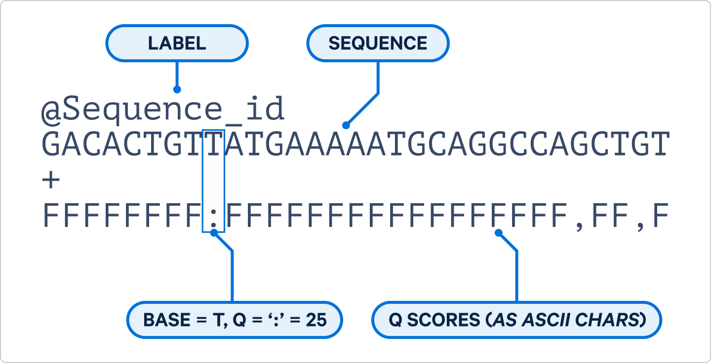

```{=html}
<script src="https://kit.fontawesome.com/ece750edd7.js" crossorigin="anonymous"></script>
```

Each sequencing application has slightly different requirements and expectations regarding data quality. In this session, we will cover quality assessment and discuss considerations specific to different types of sequencing data.

## Short Reads

For short-read sequencing, we will use [FastQC](https://www.bioinformatics.babraham.ac.uk/projects/fastqc/), [FastQ Screen](https://www.bioinformatics.babraham.ac.uk/projects/fastq_screen/) and [MultiQC](https://seqera.io/multiqc/) to assess and summarise the quality of [FASTQ](https://en.wikipedia.org/wiki/FASTQ_format) files.

### FASTQ

FASTQ is a standardised file format that stores both the sequence information and the quality scores for each read. A single sequence entry in FASTQ format consists of four lines: 

1. Sequence identifier or read name (usually beginning with @)
2. Nucleotide sequence
3. A separator line (usually just a + character)
4. Quality score for each base, represented using [Phred](https://en.wikipedia.org/wiki/Phred_quality_score) quality scores. 

An example of a single sequence can be found below.

{width="399"}

Phred quality scores are encoded as ASCII characters. This allows the quality scores to be stored as a single character, which is more efficient for storage and processing. You can convert the ASCII character to a Phred quality score using this [table](https://help.basespace.illumina.com/files-used-by-basespace/quality-scores). However, most tools will automatically handle the conversion for you.

A FASTQ file can contain millions of individual sequence reads, with each read represented by its own four-line entry. When working with paired-end sequencing data, each sample will typically have two FASTQ files. These files contain the reads generated from the two ends of each fragment and are usually referred to as the forward (R1) and reverse (R2) reads.

To be able to look at sequencing results, we will use the files from the sample we downloaded using the SRA toolkit in the previous session (SRR15372746).

:::: challenge
<h2><i class="fas fa-pencil-alt"></i> Challenge:</h2>

Take a look at the files which were downloaded. Can you identify from the files if this data is single end or paired end sequencing?

<details>

<summary>Solution</summary>

::: solution
<h2><i class="far fa-eye"></i> Solution:</h2>

To look at the files in the folder, we can use `ls`.

``` bash
ls
```

There are files containing \_1 and \_2. These files belong together and indicate that we are working with paired end data.
:::

</details>
::::

This dataset contains whole genome paired end data from a single HeLa cell line. For sequencing, both the forward and reverse reads were generated at a length of 150 bp, commonly described as 2 × 150 bp sequencing.

### FastQC

FastQC is a tool that provides simple quality control checks on FASTQ files and creates several exploratory plots. FastQC can be installed as a command line tool and also available for Windows with a graphical interface. The command can take multiple files at once or you can use wildcards to specify multiple files. Once running, it will provide a progress report for each file.

``` bash
fastqc SRR15372746_1.fastq SRR15372746_2.fastq
```
OR
``` bash
fastqc *.fastq
```

FastQC generates a zip file as well as an html file for each input. The html file is the easiest file to view and contains several plots and tables that provide information about the quality of the data. The zip file contains the raw data used to generate the plots, which can be useful for further analysis or troubleshooting.

#### Set up a web folder to view the results

The best way to view an html file is via a web browser. The Bioinformatics Core has a web server available for this purpose. Follow the steps below to set up a web folder to view your analysis results.

1. Create a folder in your home directory called `public_html` if it does not already exist. Anything in this folder is visible publicly on the internet.

``` bash
mkdir ~/public_html
cd ~/public_html
```

2. Link your analysis folder to the `public_html` folder. This will create a symbolic link to your analysis folder, allowing you to access the files via a web browser.

``` bash
ln -s /path/to/your/analysis/folder .
```

3. Open a web browser on your own machine and navigate to `https://bifx-core3.bio.ed.ac.uk/~username` replacing `username` with your username. Find and open the FastQC results file.

::: discussion
<h2><i class="fas fa-exclamation-triangle"></i> Warning:</h2>
Any files or folders in your `public_html` folder are publicly accessible. Be careful not to put any sensitive data in this folder or any raw data which should not be publicly accessible.  
:::

Alternatively, you can download data to your own machine for viewing. Applications like [FileZilla](https://filezilla-project.org/) and [Cyberduck](https://cyberduck.io/) can connect to remote servers and transfer files. 

You can also view the precomputed output at the links below: 

- [Forward reads](https://bifx-core3.bio.ed.ac.uk/~hdeweer/Training/DataQC/fastqc/SRR15372746_1_fastqc.html)
- [Reverse reads](https://bifx-core3.bio.ed.ac.uk/~hdeweer/Training/DataQC/fastqc/SRR15372746_2_fastqc.html)

::: resources
<h2><i class="far fa-bell"></i> Discussion</h2>

Take a look at the results, is there anything that stands out? We will go through each of the plots and tables and discuss what they mean.

:::

To get a better idea of the ranges you might get when looking at quality information, FastQC has some examples of [good quality](https://www.bioinformatics.babraham.ac.uk/projects/fastqc/good_sequence_short_fastqc.html) data and [bad quality data](https://www.bioinformatics.babraham.ac.uk/projects/fastqc/bad_sequence_fastqc.html).

:::: challenge
<h2><i class="fas fa-pencil-alt"></i> Challenge:</h2>

Take a look at the good and bad quality data, what are some of the main differences in the bad quality data?

<details>

<summary>Solution</summary>

::: solution
<h2><i class="far fa-eye"></i> Solution:</h2>

- Towards the end of the reads the quality of the bases reduces.
- There are some red spots in the per tile sequence quality.
- In the per sequence quality score, there are two bumps for the bad quality plot versus only 1 solid peak for the good quality data.
- The per base sequence content is more "choppy".
- The sequence QC content is not in line with the expected distribution.
- Some sequences contain N's (meaning they were not properly base called).
- There is a high level of duplication for some of the reads.
- There are over represented sequences present.
:::

</details>
::::

For each section, FastQC indicates if the data is good, average or bad with green, orange and red icons. Although these can be useful indicators of potential issues that may need investigation, a red flag does not necessarily mean that the data are of poor quality. FastQC was originally developed for whole-genome sequencing data, and some of its checks may not be appropriate for other sequencing applications. For example, RNA-seq, bisulphite-seq and metagenomic data can naturally produce warnings or failures because of their biological composition or library preparation.

::: resources
<h3><i class="far fa-bell"></i> Discussion</h3>

- With Illumina sequencing, it is sometimes possible to see a short region of lower-quality bases at the beginning of the reads. This can be caused by low sequence diversity, where many reads start with the same or very similar bases. For example, in RNA-seq, a random hexamer primer is used that is not truly random. A small decrease in quality at the start of the reads is therefore not necessarily a cause for concern.

- With Illumina paired-end sequencing, it is common to see a gradual decrease in quality towards the end of the reads. As sequencing progresses, base-calling accuracy can decrease. This effect is often more pronounced in R2, as the reverse read is sequenced later in the process. Low quality bases at the ends of reads can often be removed using a read trimming tool, which we will cover in a session.

- The base composition at the beginning of reads, or even the entire read, may show variation. This can be expected for some sequencing applications. For example, RNA-seq libraries with biased sequence composition at the start of reads, or amplicon sequencing that target highly conserved regions and produce non-random base composition across the entire read.

- The observed GC content may differ from the theoretical expectation for a particular organism or genome. This does not necessarily indicate a problem, particularly when the sample contains multiple species, as is common in metagenomic sequencing. Differences in genome composition between species can produce a broader or shifted GC-content distribution.

- A high level of duplication is not necessarily a sign of poor quality data. In RNA-seq, highly expressed genes can naturally generate many reads with identical sequences. Similarly, in metagenomics, reads from a highly abundant species may be over-represented in the dataset.

- Adapter sequences can remain in the data after sequencing and may be detected by FastQC. Their presence is not necessarily unexpected, particularly when inserts are shorter than the sequencing read length. Adapter sequences can usually be identified and removed using a read trimming tool before downstream analysis.

The [QCFail blog](https://sequencing.qcfail.com/) has some nice examples of things to look out for in quality control. 

:::


### MultiQC

In many projects, we need to assess the quality of multiple samples. Reviewing FastQC reports one by one is time consuming. MultiQC provides a simple way to combine the results from multiple FastQC analyses into a single report, allowing you to assess the overall quality of a study and easily identify samples that may require further investigation.

MultiQC is straightforward to use and can summarise results from dozens or even hundreds of samples in a single, easy-to-navigate report. Run multiqc on the current directory to combine the FastQC reports from both reads.

``` bash
multiqc .
```

::: challenge
<h2><i class="fas fa-pencil-alt"></i> Challenge:</h2>

Take a look at the MultiQC report. How do read 1 and read 2 differ?
:::

### FastQ Screen

Another useful form of quality control is to check for potential contaminants in your sequencing. [FastQ Screen](https://www.bioinformatics.babraham.ac.uk/projects/fastq_screen/) quickly maps a subset of reads from your FASTQ file against multiple genomes and libraries of sequencing vectors, primers and adapters. FastQ Screen requires a custom config file with all of the genome indexes you wish to map to. An example file is provided in the commands below.

Run FastQ Screen on both FASTQ files:

``` bash
fastq_screen -c "/datastore/home/genomes/tool_configs/fastq_screen/fastq_screen.conf" *.fastq
```

:::: challenge
<h2><i class="fas fa-pencil-alt"></i> Challenge:</h2>

Take a look at one of the html output reports.

- Which species do most of the reads map to?
- What are the different colours in the bar plot?
- Why are there lots of hits to mouse?

<details>

<summary>Solution</summary>

::: solution
<h2><i class="far fa-eye"></i> Solution:</h2>

- We expect most of the reads to align to the human referencs as these are HeLa cells
- They describe how a read aligns to multiple regions within a genome and between multiple genomes
- There is a lot of conserved sequence between the human and mouse reference where reads align to both
:::

</details>
::::

Examples of more concerning reports are given in the [FastQ Screen documentation](https://www.bioinformatics.babraham.ac.uk/projects/fastq_screen/).

We now have two different types of QC reports for our data. Run MultiQC again. You will need to include the `-f` argument to force it to overwrite the existing report.

``` bash
multiqc -f .
```

MultiQC finds two FastQC reports and two FastQ Screen reports in your analysis directory. Open the MultiQC report in your web browser to see the changes. MultiQC is compatible with reports from many different bioinformatics application (read trimming, mapping, quantification, variant calling etc.). This allows you to build an overall report as you proceed with your analysis. 

MultiQC really comes into it's own when you have many samples and multiple reports. We have pre-computed a MultiQC report for all 15 samples in []. You can view it [here]().

::: key-points
<h2><i class="fas fa-thumbtack"></i> Key Points:</h2>

- Raw sequencing data is typically stored in FASTQ format, which contains both the sequence information and quality scores for each read.
- Paired-end sequencing generates two FASTQ files per sample, containing the forward and reverse reads.
- FastQC is a tool that provides quality control checks.
- FastQ Screen checks for potential contaminants in sequencing data by mapping reads against multiple genomes and libraries.
- MultiQC combines results from multiple analyses into a single report.
- Quality control checks need to be interpreted in the context of the specific sequencing application and biological sample being analysed.
:::


::: exercise
<h2><i class="fas fa-pencil-alt"></i> Final Exercise:</h2>

Find a public dataset of your choice. Download the fastq files and produce a quality control report with MultiQC. Write a short summary of the quality of the data and any potential issues you identify.

:::

## Long Reads

Looking at results from long read sequencing is slightly different from short sequencing. The biggest difference might be that reads will not all be similar lengths, however we do want to look at the quality of the data that has been generated. There are many different tools available to look at long read QC, today we will look at [NanoPlot](https://github.com/wdecoster/NanoPlot), part of [NanoPack](https://github.com/wdecoster/nanopack), which supports a number of different ways to QC long read data. 

### NanoPlot

Similar to FastQC, NanoPlot creates a number of different plots to explore the generated long read data. For this, we have created a set of data to work with. The data come from genome sequencing which was sequenced on NanoPore, it has been downsampled to make sure we can take a look at the data without taking a long time.  

If you are on the bifxcore servers, the following command will link the data to your folder. 

``` bash
$ ln -s /library/training/DataQC/nanopore_small.fastq.gz ./
```

If you are on another server, the following command will download the data. 

``` bash
$ wget https://bifx-core3.bio.ed.ac.uk/~hdeweer/Training/DataQC/nanopore_small.fastq.gz
```

Once the data is available, NanoPlot can be run on the data.

``` bash
$ NanoPlot -t 8 --fastq nanopore_small.fastq.gz --loglength -o Nanopore_nanoplot --plots dot 
```

Once this is done, the data can be downloaded using FileZilla again. The data is also available through [this link](https://bifx-core3.bio.ed.ac.uk/~hdeweer/Training/DataQC/Nanopore_nanoplot/NanoPlot-report.html).

::: challenge
<h2><i class="fas fa-pencil-alt"></i> Challenge:</h2>

Take a look at the results of NanoPlot results. Is there anything that stands out? How does this data differ from the Illumina data we looked at previously?

:::

\

With NanoPore data, the quality of the data is generally lower than with Illumina. However the reads can become very long. This is great for assembly of genomes but the accuracy will not be helpful for all applications. PacBio data can be very different, we have prepared a NanoPlot for [PacBio data](bifx-core3.bio.ed.ac.uk/~hdeweer/Training/DataQC/Nanopore_pacbio/NanoPlot-report.html) as well. 

::: challenge
<h2><i class="fas fa-pencil-alt"></i> Challenge:</h2>

Take a look at the results of PacBio results. Is there anything that stands out? How does this data differ from the Illumina and Nanopore data?

:::

\


