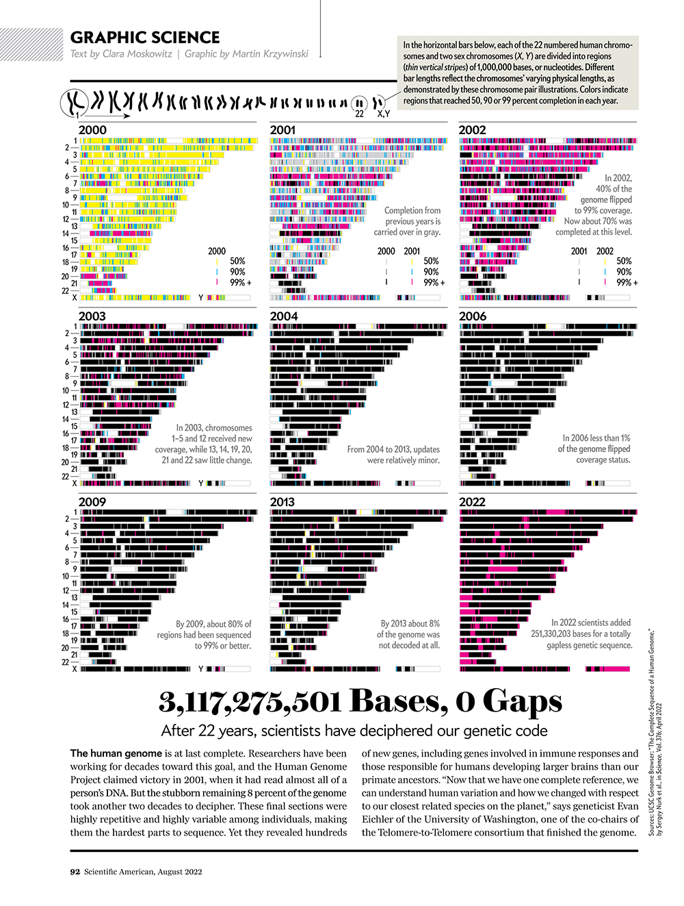

```{=html}
<script src="https://kit.fontawesome.com/ece750edd7.js" crossorigin="anonymous"></script>
```

One of the most common tasks in sequencing analysis is to map reads to a reference genome using an alignment tool. These tools work by aligning the read sequence to best match positions on the reference sequence. These alignments can give us the location of ChIP-seq peaks, the expression of genes in RNA-seq data, or the location of variants in whole genome sequencing data. In this session, we will explore how to find and download reference genomes for different species.

## Genome assemblies

A genome assembly is a reference sequence of a particular species, which serves as a template for mapping and analysing genomic data. Different assemblies may exist for the same species, representing different versions of the reference genome.

When a reference genome sequence is published it is given a name or ID. Reference sequences are continually being improved by re-sequencing and new versions are given a new name. These unique names are often referred to as the genome **assembly** or genome **build**.



For example, the human genome has several assemblies including hg19 (also known as GRCh37) and hg38 (also known as GRCh38). These assemblies differ in terms of the reference sequence, the annotation of genomic features, and the coordinates used to represent genomic locations.

Human genome assemblies:

-   NCBI34 / hg16: July 2003
-   NCBI35 / hg17: May 2004
-   NCBI36 / hg18: March 2006
-   GRCh37 / hg19: Feb 2009
-   GRCh38 / hg38: Dec 2013
-   CHM13 : Mar 2021 (Gapless Telomere-to-telomere assembly)

The reference sequence changes with each release of a genome build

-   Chromosome lengths can change
-   Each genome build has a specific co-ordinate system
    -   Chr1 position 1000000 is T in hg19 and G in hg38!

It is **extremely important** to choose the correct assembly for your data and to avoid comparing datasets mapped to different assemblies.

Finding and downloading a proper reference genome can sometimes be a challenge. Thankfully, the  **ENSEMBL** and **NCBI** databases provide accessible resources to search and download reference genomes for many different species.

## ENSEMBL

The [ENSEMBL](http://ensembl.org/index.html) database is a joint project between the European Bioinformatics Institute (EBI) and the Wellcome Sanger Institute. It provides a centralised resource for genomic data, including reference genomes, gene annotations, and other related information.

ENSEMBL reference genomes are highly curated and contain information about genes, transcripts and proteins. These are accompanied by functional annotations that include protein domains, genetic variation, homology, syntenic regions and regulatory elements.

Let's take a look at the human genome:

1. Open the ENSEMBL home page and go to the **Genome selector**.
2. Click on **Homo sapiens** to view the human genome (The first icon is a hand print).
3. The most recent annotated version of the human genome is at the top and pre-selected (GRCh38.p14).

Once one or more genomes are selected, you can use these genomes to browse the ENSEMBL website and explore genome sequences and features. If we want to use this data outside of ENSEMBL then we can download it.

1. Click on the `FTP` link for GRCh38.p14 in the Genome selector view.
2. Go into the `genome` folder.
 
The genome is available in masked and unmasked formats. Masked means that repeated regions are changed so that they are hidden for specific applications. Unless the application specifically indicated it needs a masked genome, using the unmasked genome is the best way to go. Hard masked reference sequences replace repetitive sequence with N characters, while soft masking keeps the original sequence but marks it as repetitive by using lowercase letters.

We can download files onto a Linux machine with the `wget` command. Right click on `unmasked.fa.gbz` and copy the link, then provide this as an argument to `wget`:

``` bash
wget https://ftp.ebi.ac.uk/pub/ensemblorganisms/GCA/000/001/405/29/ensembl/2026_04/genome/unmasked.fa.bgz
```
We can also download gene annotations for this genome assembly. Navigate to the `geneset` folder for GRCh38.p14 and take a look at the available files. There are two different fasta files containing the nucleotide sequences for genes (cDNA) and the amino acid sequences for annotated proteins (pep). Gene annotations are available in two different versions, genes and genes-including_alt. The alt sequences are alternative haplotypes for the genome assembly. In most cases, alt annotations create redundancy in analysis, therefore the genes file is the most often used annotation. Both files are available in gff3 and gtf formats. These are very similar and contain models for genes, transcripts and exons. The gff3 format is more general and can be used to describe many different types of genomic features, while the gtf format is specifically designed for genes.

:::: challenge
<h2><i class="fas fa-pencil-alt"></i> Challenge:</h2>

Download the `genes.gtf.bgz` GTF annotation file. 

<details>

<summary>Solution</summary>

::: solution
<h2><i class="far fa-eye"></i> Solution:</h2>

Use `wget` to download the gene annotation file:

``` bash
wget https://ftp.ebi.ac.uk/pub/ensemblorganisms/GCA/000/001/405/29/ensembl/2026_04/geneset/genes.gtf.bgz
```

:::

</details>
::::

:::: challenge
<h2><i class="fas fa-pencil-alt"></i> Challenge:</h2>

Extract both files and inspect the first few lines.
These files are compressed with `bgzip`. Look at the `bgzip` command to see how to decompress these files.

<details>

<summary>Solution</summary>

::: solution
<h2><i class="far fa-eye"></i> Solution:</h2>

We can use `bgzip` to unpack both files and `head` to view the first few lines of each file.

``` bash
bgzip -d genes.gtf.bgz
bgzip -d unmasked.fa.bgz

head genes.gtf
head unmasked.fa
```

:::

</details>
::::

## NCBI

As we have seen already, NCBI is a large resource for many different databases of biological data. One of these databases is the [genome](https://www.ncbi.nlm.nih.gov/datasets/genome/) repository. Unlike ENSEMBL, these genomes are not always as highly curated and people can upload their own genomes to this repository. Genomes can be uploaded in different states of assembly, meaning that some of the genomes are only partially assembled and/or annotated. This is often where you will find genomes for species that are not well studied.

:::: challenge
<h2><i class="fas fa-pencil-alt"></i> Challenge:</h2>

Go to the NCBI genome website and search for "Homo sapiens". How many genomes are available for human? How many of these are complete genomes? 

***Hint:** use the filters to select only complete genomes*

<details>

<summary>Solution</summary>

::: solution
<h2><i class="far fa-eye"></i> Solution:</h2>

At the time of writing there were 2,578 genomes available for humans. Of these only 4 are considered to be complete. 

:::

</details>
::::

A complete genome is one that is fully assembled, with no gaps or unplaced scaffolds. These Telomere-2-Telomere (T2T) assemblies are relatively new and achieved through advances in long read sequencing.

The reference genome we previously explored at ENSEMBL is not part of the complete list. However, if we also accept genomes that are assembled to chromosome level, that reference genome (GRCh38.p14) now makes it on the list. Chromosome level genomes can still contain some gaps and minor unplaced scaffolds. Both are generally considered good quality assemblies and can be used for different applications. 

We can click the name of an assembly to go to the assembly page. Here more information can be found on the assembly and annotation of the genome. 

To download the genome, click **FTP** at the top of the page. There are multiple different files available, lets look at some of the most commonly used files. The following suffixes are at the end of the file names:

- `*genomic.fna.gz` contains the genome sequence
- `*genomic.gtf.gz` contains gene models and annotations
- `*genomic.gbff.gz` contains a genbank file which contains both sequence and gene descriptions
- `*protein.faa.gz` contains protein sequences


::: resources
<h2><i class="fas fa-note"></i> Discussion</h2>

What to consider when evaluating a reference genome:

- The number of sequences within the assembly. The closer to the expected number of chromosomes, the better it should be. It is important to also take into account the full genome size and whether that is in line with what you expect for the reference genome. 
- The quality of the annotation. In terms of annotation, it is often good to check how many genes have been annotated. 
- Generally, it's good to have a genome which is the species you are studying. However, if the genome for your specific species is not great, but a closely related species is high quality, it might be worth taking the related species.

:::

